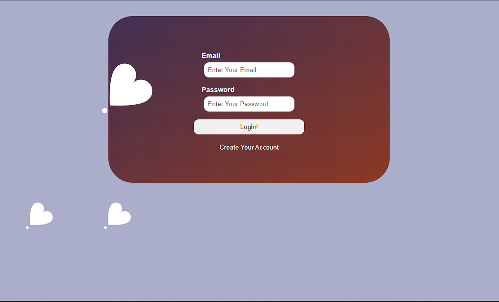
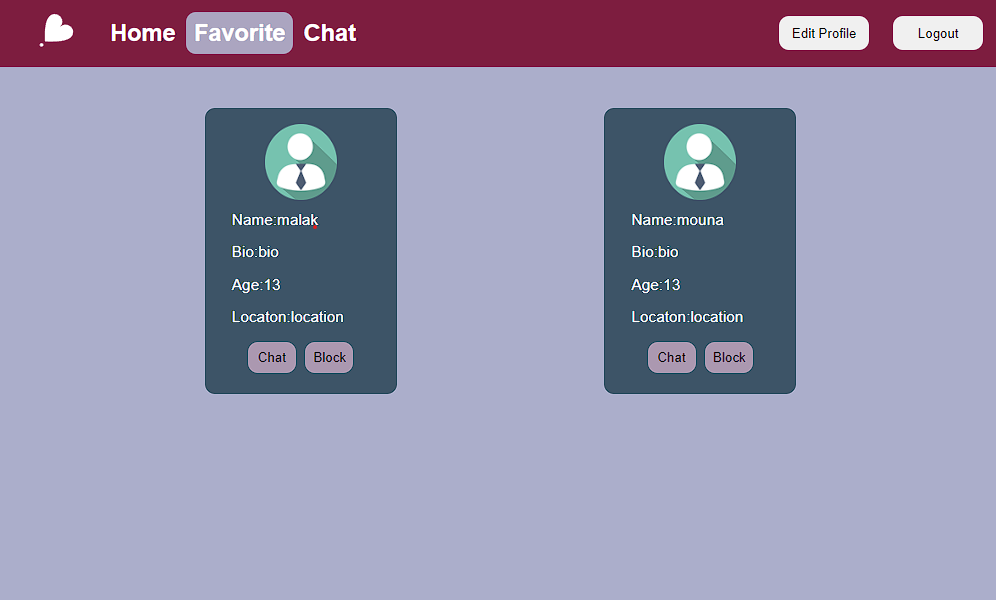

<h1>#Dating-Website</h1>

dating website using Vanilla HTML, CSS, JS, and Laravel.

 
Used may help to run
<ul>
    <li>php artisan make:controller  nameit</li>
   <li>  php artisan make:migration create_name_table</li>
    <li>php artisan make:migration modify_name_table</li>
    <li>php artisan migrat</li>
    <li>php artisan make:model Store</li>
    <li>php artisan make:middleware StoreMiddleware</li>
    <li>
    composer require -w tymon/jwt-auth --ignore-platform-reqs</li>
    <li>composer require tymon/jwt-auth</li>
    <li>php artisan vendor:publish --provider="Tymon\JWTAuth\Providers\LaravelServiceProvider"</li>
    <li>php artisan jwt:secret</li>
    <li>php artisan make:migration modify_chats_table</li>
    <li>etc</li>
</ol>

<h2>Login</h2>

<h2>Sigup!</h2>

<h2>Home</h2>

<h2>Favorite</h2>

<h2>Chat</h2>

 
